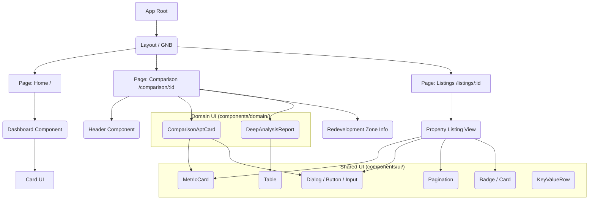

# Frontend Component Architecture

**프로젝트**: 씨드핏 (Seed Fit)
**작성일**: 2026-04-26 (업데이트됨)

본 문서는 씨드핏 프론트엔드 프로젝트의 컴포넌트 계층 구조, 현재 설계 현황, 그리고 향후 개선점을 분석합니다.

---

## 1. 컴포넌트 계층 차트 (Component Hierarchy)

현재 프론트엔드는 Next.js App Router 아키텍처를 기반으로 하며, 도메인/UI 컴포넌트로 분리되어 있습니다.

---

## 2. 컴포넌트 구조 현황

1. **모바일 퍼스트 (Mobile-First) 설계 완비**
   - **반응형 GNB**: 모바일 화면에서는 햄버거 메뉴와 오버레이 레이아웃으로 동적 전환됩니다.
   - **유니파이드 테이블 (Unified Table)**: `DeepAnalysisReport` 컴포넌트는 모바일과 데스크톱 모두 통합된 3열(구분/재개발/기축) 구조를 공유하되, 화면 너비에 따라 가로 스크롤(`overflow-x-auto`)과 폰트 크기를 조절하는 반응형으로 진화했습니다.
   - **터치 타겟 규격화**: 모바일 사용자 경험(UX) 극대화를 위해 인터랙티브 요소는 최소 44px 이상으로 정렬되었습니다.

2. **Atomic Design & UI Primitives 활용**
   - **Shadcn UI 기반**: `Button`, `Card`, `Dialog` 등 애플리케이션의 뼈대가 되는 기본 UI 요소들을 `components/ui/`에 배치.
   - **CVA(Class Variance Authority)**: `MetricCard` 등에 cva를 적용하여, `highlight={ "blue" | "mint" }` 등 직관적인 Prop만으로 색상 위계를 완벽하게 제어합니다.
   
3. **비즈니스 도메인 컴포넌트 격리**
   - 1:1 대조의 핵심인 `ComparisonAptCard.tsx`와 `DeepAnalysisReport.tsx`를 도메인 폴더로 분리.
   - **데이터 주도형(Data-Driven) 렌더링**: 리포트 내 하드코딩 표를 배열(Array) 순회 방식으로 변경하여 유지보수성 극대화.

4. **로고 및 에셋 최적화**
   - GNB의 기존 픽셀화된 PNG 로고를 고화질 **벡터 기반 SVG (seedfit-logo.svg)**로 전면 교체하여 해상도 독립성(Resolution Independent)과 깔끔한 투명 배경을 확보했습니다.

---

## 3. 개선점 및 향후 과제 (Improvement Points)

1. **상태 관리 (State Management) 고도화**
   - 향후 "가용 현금 역산 필터 결과" 등 전역 상태가 늘어날 경우, Zustand 같은 라이브러리의 도입이 필요합니다.

2. **보안 게이트웨이 (PasscodeGuard) 구현 대기**
   - B2B 파트너 및 Admin 전용 라우트에 접근하기 위한 서버/클라이언트 단의 PasscodeGuard 미들웨어 구축이 요구됩니다.

3. **서버 컴포넌트(RSC) 점진적 전환**
   - 초기 렌더링 성능 최적화와 SEO 강화를 위해, 상호작용이 없는 정적 데이터 표시 부분은 서버 컴포넌트로 분리하는 리팩토링이 권장됩니다.
