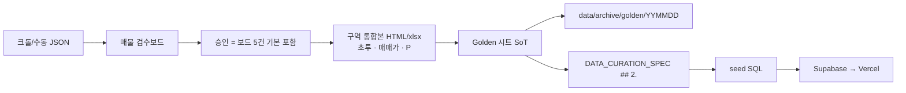
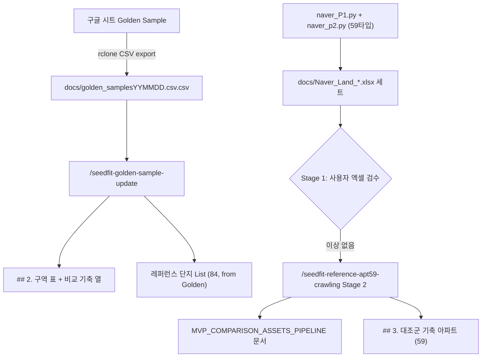

# 📊 SeedFit 데이터 큐레이션 명세서 (Data Curation Spec v.2)

> **목적:** 구역 마스터 데이터를 '티어(Tier)' 대신 '행정구' 단위로 구조화하여 단일 진실 공급원(Single Source of Truth)을 유지합니다. 
> 앱 내부에서는 데이터베이스의 '최저 실투자금'을 기준으로 유저의 가용 예산과 실시간 자동 매칭(T1~T4)됩니다.

---

## 1. 가용 현금 티어 매칭 로직 (System Level)
*사용자가 입력하는 가용 현금과 구역의 '최소 실투자금'을 비교하여 시스템이 동적으로 분류하는 기준입니다.*

| 자동 분류 티어 | 예산 범위 (최소 실투자금) | 타겟 지역 성격 | 비고 |
| :--- | :--- | :--- | :--- |
| **Tier 1 (T1)** | **1억 ~ 3억 미만** | 서울 외곽 소액 투자 / 핵심지 극초기 단계 | 스마트 비기너 입문 |
| **Tier 2 (T2)** | **3억 ~ 5억 미만** | 서울 중위권 구역 / 상급지 초기 단계 | 가장 두터운 수요층 |
| **Tier 3 (T3)** | **5억 ~ 10억 미만** | 서울 상급지 (성동, 동작 등) 중기 단계 | 고관여 투자자 |
| **Tier 4 (T4)** | **10억 이상** | 강남권, 한남, 성수 등 초우량 구역 / 후기 단계 | 퀀트/전문 투자자 |

---

## 2. 재개발 구역 마스터 데이터 (구별 Golden Samples)
*운영팀은 이 표(또는 연결된 스프레드시트)에서 행정구별로 시세만 업데이트합니다.*

> **비교 기축·레퍼런스 List SoT:** Golden Sample 시트의 `비교 기축 아파트` + `기축 아파트 시세(억)`가 원천이다.
> `/seedfit-golden-sample-update`가 구역 표의 `비교 기축 아파트 (84타입 기준)` 열과 `### 🏢 레퍼런스 단지 List`를 **같은 시트에서 함께** 갱신한다.
> 59타입 Naver Land 세트(`/seedfit-reference-apt59-crawling`)로는 이 열·List를 갱신하지 않는다 (`## 3.` 대조군만).
>
> **시트 보조탭:** `시트1`(행정동→비교기축단지) · `단지별시세`(단지→시세). 본표 O열은 `VLOOKUP(B{행},시트1)`·P열은 `VLOOKUP(O{행},단지별시세)`로 **같은 행**을 가리켜야 한다. 정렬 후 행번호가 어긋나면 오매칭된다 (`scripts/data/repair_ref_vlookup_and_map_tab.py`).
>
> **coverage:** 매칭 본선은 `CORE`(정비구역지정 이후). `SUB`(구역지정 전)는 유지하되 역필터·스캐터 기본에서 제외 (`## 4.1`, `DATA_MANAGEMENT_PLAN.md` §2.2).

### 📍 강북구
| 구역명 | 행정동 | 현재 단계 | 예상 실투자금 | 매매가 | P | 자동 매칭 분류(참고) | 특징/호재 | 비교 기축 아파트 (84타입 기준) |
| :--- | :--- | :--- | :--- | :--- | :--- | :---: | :--- | :--- |
| **미아 2구역** | 미아동 | 조합설립인가 | 약 6.2억 ~ 10.5억 | 약 7.5억 ~ 12.5억 | — | T3 | 22년 4월 11일 조합설립인가 | 래미안센터피스 20억 |
| **미아 3구역** | 미아동 | 관리처분인가 | 약 12억 ~ 12억 | 약 12억 ~ 12억 | — | T4 | 18년 1월 4일 관리처분인가 | 래미안센터피스 20억 |
| **미아 4구역** | 미아동 | 관리처분인가 | 약 11.2억 ~ 16억 | 약 11.2억 ~ 16억 | 약 4.5억 ~ 4.5억 | T4 | 23년 11월 30일 관리처분인가 | 래미안센터피스 20억 |
| **미아 9-2구역(재건축)** | 미아동 | 사업시행인가 | 약 5.4억 ~ 10억 | 약 6억 ~ 10억 | — | T3 | 23년 8월 30일 사업시행인가 | 래미안센터피스 20억 |

### 📍 광진구
| 구역명 | 행정동 | 현재 단계 | 예상 실투자금 | 매매가 | P | 자동 매칭 분류(참고) | 특징/호재 | 비교 기축 아파트 (84타입 기준) |
| :--- | :--- | :--- | :--- | :--- | :--- | :---: | :--- | :--- |
| **자양 7구역** | 자양동 | 조합설립인가 | 약 16.1억 ~ 17.9억 | 약 17억 ~ 20억 | 약 5억 | T4 | 21년 10월 13일 조합설립인가 | 롯데캐슬이스트폴 26.8억 |
| **자양1동 779(모아타운)** | 자양동 | (모아)관리계획고시 | 약 4.3억 ~ 4.8억 | — | — | T2 | 26년 3월 26일 통합심의통과 | 롯데캐슬이스트폴 26.8억 |
| **자양2동 649(B)(모아타운)** | 자양동 | (모아)관리계획고시 | 약 6.9억 ~ 7.8억 | 약 9억 ~ 9억 | — | T3 | 25년 11월 10일 통합심의통과 | 롯데캐슬이스트폴 26.8억 |
| **자양4동 A구역** | 자양동 | 정비구역 지정 | 약 15.8억 ~ 18억 | 약 17.5억 ~ 18억 | 약 10억 | T4 | 26년 조합설립인가 임박 | 롯데캐슬이스트폴 26.8억 |
| **자양동 227-147** | 자양동 | 정비구역지정 | 약 9억 ~ 10.25억 | 약 10.5억 ~ 12.5억 | 약 5.6억 | T3 | 25년 10월 15일 신통기획 완료 26년 5월 6일 정비구역 지정 | 롯데캐슬이스트폴 26.8억 |
| **자양동 772-1(건대모아)** | 자양동 | (모아)관리계획고시 | 약 4.7억 ~ 5.1억 | 약 6.7억 ~ 7.5억 | — | T2 | 26년 3월 30일 관리계획 수립 | 롯데캐슬이스트폴 26.8억 |
| **구의1동 221-1** | 구의동 | 연번 부여 | 약 4억 ~ 5억 | 약 5.4억 ~ 6.5억 | — | T2 | 26년 5월 6일 연번 부여 | 래미안구의파크스위트 20억 |
| **구의동 32** | 구의동 | 신속통합기획 대상지 선정 | 약 6억 | 약 6억 ~ 7.3억 | — | T3 | 26년 3월 16일 연번부여 노후도 72% | 래미안구의파크스위트 20억 |
| **구의동 46** | 구의동 | 신속통합기획 대상지 선정 | 약 3.3억 ~ 4.3억 | — | — | T2 | 26년 2월 25일 대상지 선정 | 래미안구의파크스위트 20억 |
| **자양1동 593(A)(모아타운)** | 자양동 | (모아)대상지 선정 | 약 6.3억 ~ 7.5억 | — | — | T3 |  | 롯데캐슬이스트폴 26.8억 |
| **자양2동 663(C)(모아타운)** | 자양동 | (모아)대상지 선정 | 약 5.2억 ~ 6.8억 | — | — | T3 |  | 롯데캐슬이스트폴 26.8억 |
| **자양2동 681(모아타운)** | 자양동 | 대상지철회 | 약 3.9억 ~ 7.4억 | — | — | T2 | 26년 3월 12일 통합심의통과 | 롯데캐슬이스트폴 26.8억 |
| **자양동 629(모아타운)** | 자양동 | 추진준비 | 약 3.4억 ~ 4.15억 | — | — | T2 |  | 롯데캐슬이스트폴 26.8억 |
| **중곡 1구역(A5)** | 중곡동 | 신속통합기획 완료 | 약 5.99억 | 약 8.4억 ~ 8.4억 | — | T3 | 25년 2월 27일 대상지 선정 26년 3월 25일 신통기획 완료 | 래미안구의파크스위트 20억 |
| **중곡동 232-1(A4)** | 중곡동 | 신속통합기획 대상지 선정 | 약 2억 ~ 2.5억 | 약 5.25억 ~ 5.4억 | — | T1 | 25년 12월 4일 연번 부여 26년 5월 7일 신통대상지 선정 노후도 74% | 래미안구의파크스위트 20억 |

### 📍 구리시
| 구역명 | 행정동 | 현재 단계 | 예상 실투자금 | 매매가 | P | 자동 매칭 분류(참고) | 특징/호재 | 비교 기축 아파트 (84타입 기준) |
| :--- | :--- | :--- | :--- | :--- | :--- | :---: | :--- | :--- |
| **수택 2구역** | 수택동 | 조합설립인가 | 약 2.4억 ~ 2.9억 | 약 3.1억 ~ 3.9억 | — | T1 | 24년 6년 19일 조합설립인가 | e편한세상인창어반포레 13.5억 |

### 📍 금천구
| 구역명 | 행정동 | 현재 단계 | 예상 실투자금 | 매매가 | P | 자동 매칭 분류(참고) | 특징/호재 | 비교 기축 아파트 (84타입 기준) |
| :--- | :--- | :--- | :--- | :--- | :--- | :---: | :--- | :--- |
| **독산 1구역** | 독산동 | 사업시행자 지정 | 약 6.9억 ~ 11.8억 | 약 6.9억 ~ 12억 | — | T3 | 26년 6월 25일 사업시행자 지정 | 금천롯데캐슬골드파크1차 13억 |
| **독산 2구역** | 독산동 | 조합설립인가 | 약 4.8억 ~ 8.8억 | 약 4.8억 ~ 10.7억 | — | T2 | 26년 7월 31일 조합설립인가 | 금천롯데캐슬골드파크1차 13억 |
| **독산시흥구역** | 독산동 | 조합설립인가 | 약 3.35억 ~ 9.3억 | 약 6.58억 ~ 9.3억 | — | T2 | 25년 8월 21일 조합설립인가 | 금천롯데캐슬골드파크1차 13억 |

### 📍 동대문구
| 구역명 | 행정동 | 현재 단계 | 예상 실투자금 | 매매가 | P | 자동 매칭 분류(참고) | 특징/호재 | 비교 기축 아파트 (84타입 기준) |
| :--- | :--- | :--- | :--- | :--- | :--- | :---: | :--- | :--- |
| **용두 7구역** | 용두동 | 추진위 승인 | 약 3.15억 ~ 3.8억 | — | — | T2 | 용두동 39 | 래미안크레시티 18억 |
| **이문 4구역** | 이문동 | 관리처분인가 | 약 13억 ~ 14.5억 | 약 13억 ~ 14.5억 | — | T4 | 24년 4월 1일 관리처분인가 | 이문아이파크자이 18.3억 |
| **전농 8구역** | 전농동 | 조합설립인가 | 약 9.5억 ~ 12.55억 | 약 11.5억 ~ 12.55억 | — | T3 | 21년 12월 8일 조합설립인가 | 래미안크레시티 18억 |
| **제기 4구역** | 제기동 | 관리처분인가 |  | — | — | - | 22년 8월 25일 관리처분인가 | 래미안크레시티 18억 |
| **제기 6구역** | 제기동 | 관리처분인가 | 약 9.8억 ~ 9.8억 | 약 9.8억 ~ 9.8억 | — | T3 | 23년 11월 10일 관리처분인가 | 래미안크레시티 18억 |
| **청량리 6구역** | 청량리동 | 사업시행인가 |  | — | — | - | 관리처분인가 임박 (26년 4월 29일 공람, 인가 확정 아님) | 래미안크레시티 18억 |
| **청량리 8구역** | 청량리동 | 관리처분인가 | 약 12억 ~ 12억 | 약 12억 ~ 12억 | 약 8억 ~ 8억 | T4 | 25년 9월 25일 관리처분인가 | 래미안크레시티 18억 |
| **전농 10구역** | 전농동 | 연번 부여 | 약 2.3억 ~ 3.6억 | — | — | T1 | 26년 2월 6일 연번 부여 | 래미안크레시티 18억 |
| **전농 15구역** | 전농동 | 신속통합기획 대상지 선정 | 약 1.8억 ~ 2억 | — | — | T1 | 23년 11월 22일 대상지 선정 | 래미안크레시티 18억 |

### 📍 동작구
| 구역명 | 행정동 | 현재 단계 | 예상 실투자금 | 매매가 | P | 자동 매칭 분류(참고) | 특징/호재 | 비교 기축 아파트 (84타입 기준) |
| :--- | :--- | :--- | :--- | :--- | :--- | :---: | :--- | :--- |
| **노량진 1구역** | 노량진동 | 관리처분인가 | 약 20.2억 ~ 27억 | 약 20.2억 ~ 27억 | — | T4 | 26년 4월 23일 관리처분인가 | 라클라체자이드파인 25.6억 |
| **노량진 3구역** | 노량진동 | 관리처분인가 | 약 20억 ~ 33억 | 약 20억 ~ 33억 | — | T4 | 26년 2월 25일 관리처분인가 | 라클라체자이드파인 25.6억 |
| **노량진 7구역** | 대방동 | 관리처분인가 | 약 21억 ~ 31억 | 약 21억 ~ 31억 | 약 18.1억 ~ 18.1억 | T4 | 24년 5월 7일 관리처분인가 | 라클라체자이드파인 25.6억 |
| **사당 12구역** | 사당동 | 추진위 승인 | 약 1.55억 ~ 4.1억 | 약 2.5억 ~ 4.1억 | — | T1 | 26년 1월 29일 추진위 승인 | 래미안로이파크 21.5억 |
| **사당 17구역** | 사당동 | 조합설립인가 | 약 10억 ~ 13.5억 | 약 10억 ~ 13.5억 | — | T4 | 26년 8월 21일 조합설립인가 | 래미안로이파크 21.5억 |
| **사당 5구역(재건축)** | 사당동 | 사업시행인가 | 약 7.5억 ~ 12억 | 약 10억 ~ 12억 | — | T3 | 24년 2월 14일 사업시행인가 26년 3월 5일 통합심의통과 | 래미안로이파크 21.5억 |
| **상도 14구역** | 상도동 | 사업시행자 지정 | 약 6.8억 ~ 8.6억 | 약 7.5억 ~ 8.6억 | — | T3 | 25년 10월 2일 사업시행자 지정 | e편한세상상도노빌리티 22.7억 |
| **상도 15구역** | 상도동 | 시공사 선정 | 약 8억 ~ 9.6억 | 약 8억 ~ 9.6억 | — | T3 | 25년 6월 5일 사업시행자 지정 | e편한세상상도노빌리티 22.7억 |
| **상도 16구역** | 상도동 | 추진위 승인 | 약 3.9억 ~ 4억 | 약 3.9억 ~ 4억 | — | T2 | 26년 4월 29일 추진위 승인 | e편한세상상도노빌리티 22.7억 |
| **상도 21구역(모아타운)** | 상도동 | (모아)관리계획고시 | 약 1.8억 ~ 3.9억 | 약 1.8억 ~ 3.9억 | — | T1 | 25년 6월 19일 관리계획고시 | e편한세상상도노빌리티 22.7억 |
| **흑석 10구역** | 흑석동 | 추진위 승인 | 약 7억 | 약 9.5억 ~ 13.5억 | — | T3 | 25년 6월 30일 대상지 선정 | 흑석자이 24억 |
| **노량진 14구역** | 노량진동 | 신속통합기획 대상지 선정 |  | 약 10.7억 ~ 10.7억 | — | - | 26년 5월 7일 신통 대상지 선정 | 라클라체자이드파인 25.6억 |
| **사당 15구역** | 사당동 | 신속통합기획 대상지 선정 | 약 5.5억 ~ 6.4억 | — | — | T3 | 25년 8월 28일 대상지 선정 | 래미안로이파크 21.5억 |
| **사당 16구역** | 사당동 | 신속통합기획 대상지 선정 | 약 5.4억 | 약 7.3억 ~ 7.3억 | — | T3 | 25년 2월 27일 대상지 선정 | 래미안로이파크 21.5억 |
| **사당 18구역** | 사당동 | 연번 부여 | 약 2.8억 ~ 3.1억 | 약 4억 ~ 4.8억 | — | T1 | 25년 6월 13일 연번 부여 | 래미안로이파크 21.5억 |
| **사당 19구역** | 사당동 | 신속통합기획 대상지 선정 |  | — | — | - | 26년 5월 7일 신통 대상지 선정 | 래미안로이파크 21.5억 |
| **사당 21구역** | 사당동 | 신속통합기획 대상지 선정 | 약 3.7억 ~ 6.5억 | — | — | T2 | 25년 12월 11일 연번 부여 26년 5월 7일 대상지 선정 | 래미안로이파크 21.5억 |
| **상도 23구역** | 상도동 | 신속통합기획 대상지 선정 | 약 4.85억 ~ 5억 | 약 7.2억 ~ 7.9억 | — | T2 | 25년 6월 3일 대상지 선정 | e편한세상상도노빌리티 22.7억 |
| **상도 24구역** | 상도동 | 연번 부여 |  | — | — | - | 26년 3월 24일 연번 부여 | e편한세상상도노빌리티 22.7억 |
| **상도 25구역** | 상도동 | 연번 부여 | 약 3.2억 ~ 4.15억 | — | — | T2 | 25년 12월 24일 연번 부여 26년 5월 7일 신통 대상지 미선정 | e편한세상상도노빌리티 22.7억 |

### 📍 마포구
| 구역명 | 행정동 | 현재 단계 | 예상 실투자금 | 매매가 | P | 자동 매칭 분류(참고) | 특징/호재 | 비교 기축 아파트 (84타입 기준) |
| :--- | :--- | :--- | :--- | :--- | :--- | :---: | :--- | :--- |
| **공덕 7구역** | 공덕동 | 조합설립인가 | 약 9.48억 ~ 11.5억 | 약 11억 ~ 13억 | 약 6.5억 ~ 7.4억 | T3 | 26년 1월 30일 조합설립인가 | 마포자이힐스테이트 31억 |
| **공덕 8구역** | 공덕동 | 추진위 승인 | 약 7.62억 ~ 8.2억 | 약 8.5억 ~ 8.5억 | — | T3 | 26년 1월 16일 추진위 승인 | 마포자이힐스테이트 31억 |
| **염리 4구역** | 염리동 | 추진위 승인 | 약 10.65억 ~ 23.5억 | 약 13.5억 ~ 24억 | — | T4 | 26년 1월 16일 추진위 승인 | 마포프레스티지자이 28.9억 |
| **염리 5구역** | 염리동 | 정비구역지정 | 약 7.8억 ~ 24.85억 | 약 9.3억 ~ 37억 | 약 12.7억 ~ 12.7억 | T3 | 26년 4월 30일 정비구역지정(공람) | 마포프레스티지자이 28.9억 |
| **대흥 5구역** | 대흥동 | 연번 부여 | 약 4.9억 ~ 5.2억 | — | — | T2 | 25년 6월 30일 연번 부여 | 마포프레스티지자이 28.9억 |
| **신수 13구역** | 신수동 | 신속통합기획 대상지 선정 | 약 6억 ~ 6.2억 | — | — | T3 | 25년 12월 17일 대상지 선정 | 마포아이파크포레 24억 |

### 📍 서대문구
| 구역명 | 행정동 | 현재 단계 | 예상 실투자금 | 매매가 | P | 자동 매칭 분류(참고) | 특징/호재 | 비교 기축 아파트 (84타입 기준) |
| :--- | :--- | :--- | :--- | :--- | :--- | :---: | :--- | :--- |
| **북아현 2구역** | 북아현동 | 관리처분인가 | 약 16.86억 ~ 19억 | 약 16.86억 ~ 19억 | 약 15억 ~ 15억 | T4 |  | 마포프레스티지자이 28.9억 |
| **북아현 3구역** | 북아현동 | 사업시행인가 | 약 10.5억 ~ 13.61억 | 약 10.5억 ~ 23.6억 | 약 10.6억 ~ 12억 | T4 |  | 마포프레스티지자이 28.9억 |

### 📍 서초구
| 구역명 | 행정동 | 현재 단계 | 예상 실투자금 | 매매가 | P | 자동 매칭 분류(참고) | 특징/호재 | 비교 기축 아파트 (84타입 기준) |
| :--- | :--- | :--- | :--- | :--- | :--- | :---: | :--- | :--- |
| **방배 13구역** | 방배동 | 관리처분인가 | 약 20.7억 ~ 23억 | 약 20.7억 ~ 23억 | — | T4 | 18년 9월 3일 관리처분인가 | 디에이치방배 39.3억 |
| **방배 15구역(재건축)** | 방배동 | 건축심의 | 약 25억 ~ 34억 | 약 25억 ~ 36억 | — | T4 | 25년 9월 30일 통합심의통과 (재건축, 모아타운 아님) | 디에이치방배 39.3억 |

### 📍 성남시 수정구
| 구역명 | 행정동 | 현재 단계 | 예상 실투자금 | 매매가 | P | 자동 매칭 분류(참고) | 특징/호재 | 비교 기축 아파트 (84타입 기준) |
| :--- | :--- | :--- | :--- | :--- | :--- | :---: | :--- | :--- |
| **수진 1구역** | 수진동 | 관리처분인가 | 약 6.9억 ~ 7.58억 | 약 8.29억 ~ 9.5억 | 약 4.68억 ~ 4.68억 | T3 | 26년 관리처분인가 예정 | 산성역 헤리스톤  (분양권) 15.73억 |
| **신흥 1구역** | 신흥동 | 사업시행인가 | 약 7억 ~ 7.6억 | 약 7.3억 ~ 8.3억 | 약 4.6억 ~ 4.6억 | T3 | 25년 12월 29일 사업시행인가 | 산성역 헤리스톤  (분양권) 15.73억 |
| **신흥 3구역** | 신흥동 | 시공사 선정 | 약 5.6억 ~ 7.3억 | 약 7.5억 ~ 8.6억 | 약 4.05억 ~ 4.7억 | T3 | 25년 10월 시공사 선정 | 산성역 헤리스톤  (분양권) 15.73억 |

### 📍 성동구
| 구역명 | 행정동 | 현재 단계 | 예상 실투자금 | 매매가 | P | 자동 매칭 분류(참고) | 특징/호재 | 비교 기축 아파트 (84타입 기준) |
| :--- | :--- | :--- | :--- | :--- | :--- | :---: | :--- | :--- |
| **금호 16구역** | 금호동2가 | 관리처분인가 | 약 14.5억 ~ 16억 | — | — | T4 |  | 옥수파크힐스 25억 |
| **금호 21구역** | 금호동3가 | 시공사 선정 | 약 11.8억 ~ 16.4억 | 약 13억 ~ 18억 | 약 11억 | T4 | 24년 10월 18일 조합설립인가 | 옥수파크힐스 25억 |
| **금호 22구역** | 금호동 | 연번 부여 | 약 2.5억 ~ 3.5억 | — | — | T1 | 26년 4월 20일 연번 부여 | 옥수파크힐스 25억 |
| **금호 23구역** | 금호동4가 | 연번 부여 | 약 6.9억 | 약 7억 ~ 7억 | — | T3 | 26년 3월 5일 연번 부여 노후도 92% | 옥수파크힐스 25억 |
| **사근동 190-2** | 사근동 | 연번 부여 | 약 2.2억 ~ 3.7억 | — | — | T1 | 26년 1월 23일 연번 부여 | 라체르보푸르지오써밋 27억 |
| **용답 1구역** | 용답동 | 연번 부여 | 약 3.2억 ~ 3.8억 | — | — | T2 | 26년 5월 7일 신통 탈락 | 성동자이리버뷰 21.6억 |
| **용답 2구역** | 용답동 | 신속통합기획 대상지 선정 | 약 4.1억 ~ 5.5억 | 약 5.6억 ~ 5.9억 | — | T2 | 26년 5월 7일 신통대상지 선정 | 성동자이리버뷰 21.6억 |
| **행당 8구역** | 행당동 | 신속통합기획 대상지 선정 |  | 약 8억 ~ 8억 | — | - | 25년 12월 17일 신통대상지 선정 | 라체르보푸르지오써밋 27억 |

### 📍 성북구
| 구역명 | 행정동 | 현재 단계 | 예상 실투자금 | 매매가 | P | 자동 매칭 분류(참고) | 특징/호재 | 비교 기축 아파트 (84타입 기준) |
| :--- | :--- | :--- | :--- | :--- | :--- | :---: | :--- | :--- |
| **길음 5구역** | 길음동 | 조합설립인가 | 약 5.2억 ~ 6억 | 약 6억 ~ 7.3억 | 약 1.33억 ~ 1.33억 | T3 | 19년 8월 19일 조합설립인가 | 래미안센터피스 20억 |
| **신길음구역** | 길음동 | 사업시행인가 | 약 8.5억 ~ 8.5억 | 약 8.5억 ~ 8.5억 | — | T3 | 12년 11월 19일 사업시행인가 | 래미안센터피스 20억 |
| **장위 13-1구역** | 장위동 | 정비구역지정 | 약 1.6억 ~ 2억 | — | — | T1 | 장위뉴타운, 초기단계 | 서울원아이파크  (분양권) 18.6억 |
| **장위 13-2구역** | 장위동 | 정비구역지정 | 약 1.8억 ~ 2억 | — | — | T1 | 장위뉴타운, 초기단계 | 서울원아이파크  (분양권) 18.6억 |
| **장위 14구역** | 장위동 | 시공사 선정 | 약 5.5억 ~ 5.98억 | 약 5.5억 ~ 6.2억 | — | T3 | 10년 5월 26일 조합설립인가 | 서울원아이파크  (분양권) 18.6억 |
| **신월곡 1구역** | 하월곡동 | 관리처분인가 |  | — | — | - | 22년 11월 29일 관리처분인가 | 래미안센터피스 20억 |
| **장위 15구역** | 장위동 | 시공사 선정 | 약 5.25억 ~ 7.1억 | 약 7억 ~ 8억 | — | T3 | 22년 3월 28일 조합설립인가 | 서울원아이파크  (분양권) 18.6억 |

### 📍 송파구
| 구역명 | 행정동 | 현재 단계 | 예상 실투자금 | 매매가 | P | 자동 매칭 분류(참고) | 특징/호재 | 비교 기축 아파트 (84타입 기준) |
| :--- | :--- | :--- | :--- | :--- | :--- | :---: | :--- | :--- |
| **마천 1구역** | 마천동 | 조합설립인가 | 약 9.2억 ~ 11억 | 약 11억 ~ 13억 | — | T3 | 22년 5월 25일 조합설립인가 | 송파시그니처롯데캐슬 21.1억 |
| **마천 3구역** | 마천동 | 사업시행인가 | 약 10.6억 ~ 11.5억 | 약 11억 ~ 13.2억 | — | T4 | 26년 4월 2일 사업시행인가 | 송파시그니처롯데캐슬 21.1억 |

### 📍 영등포구
| 구역명 | 행정동 | 현재 단계 | 예상 실투자금 | 매매가 | P | 자동 매칭 분류(참고) | 특징/호재 | 비교 기축 아파트 (84타입 기준) |
| :--- | :--- | :--- | :--- | :--- | :--- | :---: | :--- | :--- |
| **신길 16-2구역** | 신길동 | 정비구역지정 | 약 3.7억 ~ 4.7억 | — | — | T2 | 25년 7월 신속통합기획 | 힐스테이트클래시안 20.5억 |
| **신길 2구역** | 신길동 | 사업시행인가 | 약 8.5억 ~ 13.87억 | 약 8.5억 ~ 14억 | 약 3.8억 ~ 3.8억 | T3 | 25년 9월 12일 사업시행인가 | 힐스테이트클래시안 20.5억 |
| **여의대방신길 2구역** | 신길동 | 신속통합기획 대상지 선정 | 약 3.4억 ~ 3.8억 | — | — | T2 | 25년 12월 17일 대상지 선정, 신길동 90-31 | 힐스테이트클래시안 20.5억 |

### 📍 용산구
| 구역명 | 행정동 | 현재 단계 | 예상 실투자금 | 매매가 | P | 자동 매칭 분류(참고) | 특징/호재 | 비교 기축 아파트 (84타입 기준) |
| :--- | :--- | :--- | :--- | :--- | :--- | :---: | :--- | :--- |
| **이촌1구역(재건축)** | 이촌동 | 정비구역지정 | 약 12억 ~ 14.2억 | 약 12억 ~ 14.2억 | — | T4 | 2026년 5월 14일 정비구역지정 | 이촌한가람 31억 |
| **서계통합** | 청파동 | 조합설립인가 | 약 6억 ~ 9.8억 | 약 7억 ~ 9.8억 | — | T3 | 2025년 11월 28일 추진위 승인 조합설립 임박? | 이촌한가람 31억 |
| **청파 1구역** | 청파동 | 조합설립인가 | 약 7.5억 ~ 20억 | 약 7.5억 ~ 20억 | — | T3 | 23년 2월 17일 조합설립인가 | 이촌한가람 31억 |
| **청파 2구역** | 청파동 | 조합설립인가 | 약 3.8억 ~ 8.1억 | 약 4.5억 ~ 8.1억 | — | T2 | 2024년 10월 31일 정비구역지정 | 이촌한가람 31억 |
| **남산 1구역** | 후암동 | 정비구역지정 | 약 6.2억 ~ 7억 | — | — | T3 | 25년 11월 3일 대상지 선정 | 이촌한가람 31억 |
| **동후암 1구역** | 후암동 | 추진위 승인 | 약 4.6억 ~ 6.3억 | — | — | T2 | 24년 6월 27일 대상지 선정 | 이촌한가람 31억 |
| **동후암 3구역** | 후암동 | 추진위 승인 | 약 6억 ~ 7.2억 | — | — | T3 | 24년 8월 28일 대상지 선정 | 이촌한가람 31억 |
| **후암1구역(재건축)** | 후암동 | 추진위 승인 | 약 14.5억 ~ 16억 | 약 14.6억 ~ 16억 | — | T4 | 2007년 4월 23일 추진위 승인 | 이촌한가람 31억 |
| **남산 3구역** | 용산동 | 연번 부여 | 약 4억 ~ 4.3억 | — | — | T2 |  | 이촌한가람 31억 |
| **용산 1구역** | 용산동 | 신속통합기획 대상지 선정 | 약 9.8억 ~ 10억 | — | — | T3 | 25년 8월 28일 대상지 선정, 용산동2가 1-1351 | 이촌한가람 31억 |
| **용산 3구역** | 용산동 | 신속통합기획 대상지 선정 | 약 6.6억 ~ 7.6억 | — | — | T3 | 26년 5월 7일 대상지 선정 용산동2가 35-26 | 이촌한가람 31억 |
| **용산 4구역** | 용산동 | 연번 부여 | 약 3.8억 ~ 4억 | 약 6억 ~ 6.2억 | — | T2 |  | 이촌한가람 31억 |
| **원효로3가 1구역** | 원효로3가 | 연번 부여 | 약 6.9억 | 약 8.2억 ~ 8.2억 | — | T3 | 노후도 83%, 26.05.07 대상지 탈락(반대?) 원룸매물 8.2 | 이촌한가람 31억 |
| **원효로3가 2-2** | 원효로3가 | 신속통합기획 대상지 선정 | 약 6.5억 ~ 6.5억 | — | — | T3 | 25년 6월 30일 대상지 선정 신통 신창동 29-1 | 이촌한가람 31억 |
| **이태원 1구역** | 이태원동 | 신속통합기획 대상지 선정 | 약 10억 ~ 10억 | — | — | T4 | 25년 11월 3일 대상지 선정 | 이촌한가람 31억 |
| **한남 1구역** | 이태원동 | 신속통합기획 대상지 선정 | 약 28억 ~ 30억 | 약 30억 ~ 33억 | — | T4 | 25년 2월 27일 대상지 선정 | 이촌한가람 31억 |
| **청파 3구역** | 청파동 | 신속통합기획 대상지 선정 | 약 3억 ~ 4.8억 | — | — | T2 | 25년 4월 28일 대상지 선정 | 이촌한가람 31억 |
| **남산 2구역** | 후암동 | 연번 부여 | 약 4.5억 ~ 5.6억 | 약 5.5억 ~ 7억 | — | T2 |  | 이촌한가람 31억 |
| **동후암 2구역** | 후암동 | 연번 부여 | 약 4억 | 약 5.7억 ~ 5.9억 | — | T2 | 노후도 59%로 다소 낮음 | 이촌한가람 31억 |

### 📍 은평구
| 구역명 | 행정동 | 현재 단계 | 예상 실투자금 | 매매가 | P | 자동 매칭 분류(참고) | 특징/호재 | 비교 기축 아파트 (84타입 기준) |
| :--- | :--- | :--- | :--- | :--- | :--- | :---: | :--- | :--- |
| **갈현 1구역** | 갈현동 | 관리처분인가 | 약 6.8억 ~ 7.06억 | 약 6.8억 ~ 7.06억 | — | T3 | 25년 12월 1일 착공 | 힐스테이트메디알레 15.89억 |
| **대조 1구역** | 대조동 | 관리처분인가 | 약 15.85억 ~ 16.5억 | 약 15.85억 ~ 16.5억 | — | T4 | 22년 9월 21일 착공 | 힐스테이트메디알레 15.89억 |
| **불광 5구역** | 불광동 | 관리처분인가 | 약 9.17억 ~ 10.52억 | 약 9.17억 ~ 10.52억 | — | T3 | 24년 11월 28일 관리처분인가 | 힐스테이트메디알레 15.89억 |

### 📍 중구
| 구역명 | 행정동 | 현재 단계 | 예상 실투자금 | 매매가 | P | 자동 매칭 분류(참고) | 특징/호재 | 비교 기축 아파트 (84타입 기준) |
| :--- | :--- | :--- | :--- | :--- | :--- | :---: | :--- | :--- |
| **신당 10구역** | 신당동 | 시공사 선정 | 약 12억 ~ 19억 | 약 12억 ~ 19억 | — | T4 | 9억 원룸 매물도 있음, 23년 12월 27일 조합설립인가 | 옥수파크힐스 25억 |

### 📍 중랑구
| 구역명 | 행정동 | 현재 단계 | 예상 실투자금 | 매매가 | P | 자동 매칭 분류(참고) | 특징/호재 | 비교 기축 아파트 (84타입 기준) |
| :--- | :--- | :--- | :--- | :--- | :--- | :---: | :--- | :--- |
| **중화 6구역** | 중화동 | 정비구역지정 | 약 2억 ~ 9.7억 | 약 3.5억 ~ 10억 | — | T1 | 7호선 중화역 | 사가정센트럴아이파크 14.95억 |

### 📍 양천구
| 구역명 | 행정동 | 현재 단계 | 예상 실투자금 | 매매가 | P | 자동 매칭 분류(참고) | 특징/호재 | 비교 기축 아파트 (84타입 기준) |
| :--- | :--- | :--- | :--- | :--- | :--- | :---: | :--- | :--- |
| **신정 1구역** | 신정동 | 신속통합기획 대상지 선정 | 약 3억 ~ 3.5억 | — | — | T2 | 25년 4월 28일 대상지 선정, 신정 4동 922 | 목동힐스테이트 21.8억 |

### 🏢 레퍼런스 단지 List (잠재미래가치 비교)
*84타입(34평형) 기준 주요 비교 대상 신축/준신축 기축 단지*
*최신 업데이트:2026.08.23*

> **SoT 규칙 (Golden Sample → List):** `비교 기축 아파트` + `기축 아파트 시세(억)` 열이 원천이다.
> `/seedfit-golden-sample-update`가 구글 시트(Golden Sample)에서 이 List와 `## 2.` 비교 기축 열을 **함께** 갱신한다.
> 같은 단지가 여러 구역에 쓰이면 행정구·행정동을 묶어 한 줄로 정리한다.
> 59타입 Naver Land 세트(`/seedfit-reference-apt59-crawling`)로는 이 List·비교 기축 열을 갱신하지 않는다. (`## 3.` 대조군만)

1. **강북구 미아동 / 성북구 길음동/하월곡동:** 래미안센터피스 (20억)
2. **광진구 자양동:** 롯데캐슬이스트폴 (26.8억)
3. **구리시 수택동:** e편한세상인창어반포레 (13.5억)
4. **금천구 독산동:** 금천롯데캐슬골드파크1차 (13억)
5. **동대문구 용두동/전농동/제기동/청량리동:** 래미안크레시티 (18억)
6. **동대문구 이문동:** 이문아이파크자이 (18.3억)
7. **동작구 노량진동/대방동:** 라클라체자이드파인 (25.6억)
8. **동작구 사당동:** 래미안로이파크 (21.5억)
9. **동작구 상도동:** e편한세상상도노빌리티 (22.7억)
10. **동작구 흑석동:** 흑석자이 (24억)
11. **마포구 공덕동:** 마포자이힐스테이트 (31억)
12. **마포구 대흥동/염리동 / 서대문구 북아현동:** 마포프레스티지자이 (28.9억)
13. **서초구 방배동:** 디에이치방배 (39.3억)
14. **성남시 수정구 수진동/신흥동:** 산성역 헤리스톤 (15.73억, 분양권)
15. **성동구 금호동/금호동2가/금호동3가/금호동4가 / 중구 신당동:** 옥수파크힐스 (25억)
16. **성북구 장위동:** 서울원아이파크 (18.6억, 분양권)
17. **송파구 마천동:** 송파시그니처롯데캐슬 (21.1억)
18. **영등포구 신길동:** 힐스테이트클래시안 (20.5억)
19. **용산구 용산동/원효로3가/이촌동/이태원동/청파동/후암동:** 이촌한가람 (31억)
20. **은평구 갈현동/대조동/불광동:** 힐스테이트메디알레 (15.89억)
21. **중랑구 중화동:** 사가정센트럴아이파크 (14.95억)
22. **광진구 구의동/중곡동:** 래미안구의파크스위트 (20억)
23. **마포구 신수동:** 마포아이파크포레 (24억)
24. **성동구 사근동/행당동:** 라체르보푸르지오써밋 (27억)
25. **성동구 용답동:** 성동자이리버뷰 (21.6억)
26. **양천구 신정동:** 목동힐스테이트 (21.8억)

---
## 3. 대조군 기축 아파트 데이터 (Comparison Assets)

#### NAVER LAND 기준가 반영 원칙 (59타입 · `/seedfit-reference-apt59-crawling`)

- 기준 XLSX는 반드시 `docs/Naver_Land_0720_2202.xlsx`, `docs/Naver_Land_0720_2204.xlsx` 2개 파일을 한 세트로 사용한다.
- **이 세트의 크롤 대상은 59타입(대조군)이다.** `## 2.` 비교 기축 열·`### 🏢 레퍼런스 단지 List`(84타입, Golden Sample)는 이 세트에서 갱신하지 않는다.
- 각 단지 기준가는 `매물없음`을 제외하고, 우선 `저층` 제외 `중고층` 이상 매물 중 최저가를 후보로 삼는다.
- `중고층` 이상 매물이 없고 `저층` 매물만 있으면 저층 최저가를 fallback 후보로 반영하되, 저층 기준가임을 반드시 표시한다.
- `매물없음`은 오류가 아니라 현재 사용 가능한 호가가 없다는 상태로 관리한다.
- 스크립트 산출값은 바로 앱 DB에 쓰지 않고, 이 명세서의 **대조군(`## 3.`)** 기준가를 업데이트하는 큐레이션 근거로 사용한다.
- 새 Naver Land XLSX는 두 파일을 하나의 세트로 교체한다. 파일명·기준일·수집 시각·큐레이터를 `docs/MVP_COMPARISON_ASSETS_PIPELINE260627.md`에 남긴다.
- MVP-031 기준 Comparison Assets DB 영속화는 후속 구현으로 둔다.

### 3.1 생애최초 LTV 70% 적용 모델
*내 집 마련이 처음인 사용자를 위한 공격적 대출 시나리오*

| 타겟 매매가 | 실제 최저가 | 대조 아파트명 | 소재지 | 평형 | 투자금(A)*** | 대출 Max* | 70% 적용 대출** | | 전고점(21-22년) |
| :--- | :--- | :--- | :--- | :---: | :--- | :--- | :--- | | :--- |
| **7억대** | **7.70억** | SK북한산시티 | 서울 강북구 | 24평 | **2.31억** | 6.0억 | 5.39억 | 7.80억 |
| **7억대** | **7.30억** | 하계장미 | 서울 노원구 | 21평 | **2.19억** | 6.0억 | 5.11억 | 7.65억 |
| **8억대** | **8.50억** | 주공뜨란채 | 경기 광명시 | 24평 | **2.55억** | 6.0억 | 5.95억 | 7.75억 |
| **8억대** | **9.50억** | 다산e편한세상자이 | 경기 남양주 | 24평 | **3.50억** | 6.0억 | 6.00억 | 8.90억 |
| **9억대** | **9.00억** | 월계동신 | 서울 노원구 | 28평 | **3.00억** | 6.0억 | 6.00억 | 7.80억 |
| **9억대** | **10.80억** | 초원마을대원 | 경기 안양시 | 24평 | **4.80억** | 6.0억 | 6.00억 | 8.20억 |
| **10억대** | **10.50억** | 이문동 쌍용 | 서울 동대문구 | 24평 | **4.50억** | 6.0억 | 6.00억 | 8.47억 |
| **10억대** | **11.00억** | 염창동아1차 | 서울 강서구 | 24평 | **5.00억** | 6.0억 | 6.00억 | 8.60억 |
| **11억대** | **11.30억** | 관악드림타운 | 서울 관악구 | 24평 | **5.30억** | 6.0억 | 6.00억 | 9.40억 |
| **11억대** | **13.00억** | 신정마을주공1 | 서울 양천구 | 24평 | **7.00억** | 6.0억 | 6.00억 | 8.95억 |
| **12억대** | **12.60억** | 철산래미안자이 | 경기 광명시 | 24평 | **6.60억** | 6.0억 | 6.00억 | 10.00억 |
| **12억대** | **15.00억** | 꿈의숲아이파크 | 서울 성북구 | 24평 | **9.00억** | 6.0억 | 6.00억 | 10.60억 |
| **13억대** | **14.00억** | 길음뉴타운6단지 | 서울 성북구 | 24평 | **8.00억** | 6.0억 | 6.00억 | 10.30억 |
| **13억대** | **15.10억** | 장위자이레디언트 | 서울 성북구 | 24평 | **11.10억** | 4.0억 | 4.00억 |  |
| **14억대** | **14.50억** | 우장산힐스테이트 | 서울 강서구 | 24평 | **8.50억** | 6.0억 | 6.00억 | 12.00억 |
| **14억대** | **14.95억** | 신당동 삼성 | 서울 중구 | 24평 | **8.95억** | 6.0억 | 6.00억 | 11.00억 |
| **15억대** | **15.50억** | 롯데캐슬클라시아 | 서울 성북구 | 24평 | **11.50억** | 4.0억 | 4.00억 | 12.70억 |
| **15억대** | **16.00억** | 래미안크레시티 | 서울 동대문구 | 24평 | **12.00억** | 4.0억 | 4.00억 | 13.52억 |
| **16억대** | **16.50억** | 행당한진타운 | 서울 성동구 | 24평 | **12.50억** | 4.0억 | 4.00억 | 12.05억 |
| **16억대** | **17.00억** | 사당우성2 | 서울 동작구 | 24평 | **13.00억** | 4.0억 | 4.00억 | 12.40억 |
| **17억대** | **17.80억** | 고덕센트럴IPARK | 서울 강동구 | 24평 | **13.80억** | 4.0억 | 4.00억 | 14.50억 |
| **17억대** | **18.00억** | 상도더샵1차 | 서울 동작구 | 24평 | **14.00억** | 4.0억 | 4.00억 | 12.90억 |
| **18억대** | **18.50억** | 송파시그니처롯데캐슬 | 서울 송파구 | 24평 | **14.50억** | 4.0억 | 4.00억 | 14.30억 |
| **18억대** | **18.50억** | 래미안에스티움 | 서울 영등포구 | 24평 | **14.50억** | 4.0억 | 4.00억 | 13.90억 |
| **19억대** | **20.00억** | 서울역센트럴자이 | 서울 중구 | 24평 | **16.00억** | 4.0억 | 4.00억 | 16.00억 |
| **19억대** | **20.10억** | 옥수삼성 | 서울 성동구 | 24평 | **16.10억** | 4.0억 | 4.00억 | 14.20억 |
| **20억대** | **20.45억** | 센트라스 | 서울 성동구 | 24평 | **16.45억** | 4.0억 | 4.00억 | 15.30억 |
| **20억대** | **20.50억** | 당산센트럴아이파크 | 서울 영등포구 | 24평 | **16.50억** | 4.0억 | 4.00억 | 15.50억 |
| **21억대** | **22.20억** | 공덕자이 | 서울 마포구 | 24평 | **18.20억** | 4.0억 | 4.00억 |  |
| **21억대** | **21.60억** | 마포래미안푸르지오 | 서울 마포구 | 24평 | **17.60억** | 4.0억 | 4.00억 | 17.00억 |
| **22억대** | **23.50억** | 과천푸르지오써밋 | 경기 과천시 | 24평 | **19.50억** | 4.0억 | 4.00억 | 17.40억 |
| **22억대** | **22.90억** | 광장힐스테이트 | 서울 광진구 | 24평 | **18.90억** | 4.0억 | 4.00억 | 18.00억 |
| **23억대** | **23.90억** | 옥수파크힐스 | 서울 성동구 | 24평 | **19.90억** | 4.0억 | 4.00억 |  |
| **24억대** | **24.90억** | 이촌 한가람 | 서울 용산구 | 24평 | **20.90억** | 4.0억 | 4.00억 | 19.00억 |
| **25억대** | **27.50억** | 목동신시가지7 | 서울 양천구 | 24평 | **25.50억** | 2.0억 | 2.00억 | 19.25억 |

---

### 3.2 일반 LTV 40% 적용 모델
*유주택자 혹은 일반적인 주택담보대출을 활용하는 시나리오*

| 타겟 매매가 | 실제 최저가 | 대조 아파트명 | 소재지 | 평형 | 투자금(A)*** | 대출 Max* | 40% 적용 대출** | | 전고점(21-22년) |
| :--- | :--- | :--- | :--- | :---: | :--- | :--- | :--- | | :--- |
| **7억대** | **7.70억** | SK북한산시티 | 서울 강북구 | 24평 | **4.62억** | 6.0억 | 3.08억 | 7.80억 |
| **7억대** | **7.30억** | 하계장미 | 서울 노원구 | 21평 | **4.38억** | 6.0억 | 2.92억 | 7.65억 |
| **8억대** | **8.50억** | 주공뜨란채 | 경기 광명시 | 24평 | **5.10억** | 6.0억 | 3.40억 | 7.75억 |
| **8억대** | **9.50억** | 다산e편한세상자이 | 경기 남양주 | 24평 | **5.70억** | 6.0억 | 3.80억 | 8.90억 |
| **9억대** | **9.00억** | 월계동신 | 서울 노원구 | 28평 | **5.40억** | 6.0억 | 3.60억 | 7.80억 |
| **9억대** | **10.80억** | 초원마을대원 | 경기 안양시 | 24평 | **6.48억** | 6.0억 | 4.32억 | 8.20억 |
| **10억대** | **10.50억** | 이문동 쌍용 | 서울 동대문구 | 24평 | **6.30억** | 6.0억 | 4.20억 | 8.47억 |
| **10억대** | **11.00억** | 염창동아1차 | 서울 강서구 | 24평 | **6.60억** | 6.0억 | 4.40억 | 8.60억 |
| **11억대** | **11.30억** | 관악드림타운 | 서울 관악구 | 24평 | **6.78억** | 6.0억 | 4.52억 | 9.40억 |
| **11억대** | **13.00억** | 신정마을주공1 | 서울 양천구 | 24평 | **7.80억** | 6.0억 | 5.20억 | 8.95억 |
| **12억대** | **12.60억** | 철산래미안자이 | 경기 광명시 | 24평 | **7.56억** | 6.0억 | 5.04억 | 10.00억 |
| **12억대** | **15.00억** | 꿈의숲아이파크 | 서울 성북구 | 24평 | **9.00억** | 6.0억 | 6.00억 | 10.60억 |
| **13억대** | **14.00억** | 길음뉴타운6단지 | 서울 성북구 | 24평 | **8.40억** | 6.0억 | 5.60억 | 10.30억 |
| **13억대** | **15.10억** | 장위자이레디언트 | 서울 성북구 | 24평 | **11.10억** | 4.0억 | 4.00억 |  |
| **14억대** | **14.50억** | 우장산힐스테이트 | 서울 강서구 | 24평 | **8.70억** | 6.0억 | 5.80억 | 12.00억 |
| **14억대** | **14.95억** | 신당동 삼성 | 서울 중구 | 24평 | **8.97억** | 6.0억 | 5.98억 | 11.00억 |
| **15억대** | **15.50억** | 롯데캐슬클라시아 | 서울 성북구 | 24평 | **11.50억** | 4.0억 | 4.00억 | 12.70억 |
| **15억대** | **16.00억** | 래미안크레시티 | 서울 동대문구 | 24평 | **12.00억** | 4.0억 | 4.00억 | 13.52억 |
| **16억대** | **16.50억** | 행당한진타운 | 서울 성동구 | 24평 | **12.50억** | 4.0억 | 4.00억 | 12.05억 |
| **16억대** | **17.00억** | 사당우성2 | 서울 동작구 | 24평 | **13.00억** | 4.0억 | 4.00억 | 12.40억 |
| **17억대** | **17.80억** | 고덕센트럴IPARK | 서울 강동구 | 24평 | **13.80억** | 4.0억 | 4.00억 | 14.50억 |
| **17억대** | **18.00억** | 상도더샵1차 | 서울 동작구 | 24평 | **14.00억** | 4.0억 | 4.00억 | 12.90억 |
| **18억대** | **18.50억** | 송파시그니처롯데캐슬 | 서울 송파구 | 24평 | **14.50억** | 4.0억 | 4.00억 | 14.30억 |
| **18억대** | **18.50억** | 래미안에스티움 | 서울 영등포구 | 24평 | **14.50억** | 4.0억 | 4.00억 | 13.90억 |
| **19억대** | **20.00억** | 서울역센트럴자이 | 서울 중구 | 24평 | **16.00억** | 4.0억 | 4.00억 | 16.00억 |
| **19억대** | **20.10억** | 옥수삼성 | 서울 성동구 | 24평 | **16.10억** | 4.0억 | 4.00억 | 14.20억 |
| **20억대** | **20.45억** | 센트라스 | 서울 성동구 | 24평 | **16.45억** | 4.0억 | 4.00억 | 15.30억 |
| **20억대** | **20.50억** | 당산센트럴아이파크 | 서울 영등포구 | 24평 | **16.50억** | 4.0억 | 4.00억 | 15.50억 |
| **21억대** | **22.20억** | 공덕자이 | 서울 마포구 | 24평 | **18.20억** | 4.0억 | 4.00억 |  |
| **21억대** | **21.60억** | 마포래미안푸르지오 | 서울 마포구 | 24평 | **17.60억** | 4.0억 | 4.00억 | 17.00억 |
| **22억대** | **23.50억** | 과천푸르지오써밋 | 경기 과천시 | 24평 | **19.50억** | 4.0억 | 4.00억 | 17.40억 |
| **22억대** | **22.90억** | 광장힐스테이트 | 서울 광진구 | 24평 | **18.90억** | 4.0억 | 4.00억 | 18.00억 |
| **23억대** | **23.90억** | 옥수파크힐스 | 서울 성동구 | 24평 | **19.90억** | 4.0억 | 4.00억 |  |
| **24억대** | **24.90억** | 이촌 한가람 | 서울 용산구 | 24평 | **20.90억** | 4.0억 | 4.00억 | 19.00억 |
| **25억대** | **27.50억** | 목동신시가지7 | 서울 양천구 | 24평 | **25.50억** | 2.0억 | 2.00억 | 19.25억 |

---

### * 대출 원칙 및 산식 (Curation Rule)
1. **대출 Max 금액 (제약조건):**
   - 15억 이하: 최대 6억
   - 15억 초과 25억 이하: 최대 4억
   - 25억 초과: 최대 2억
2. **최종 대출금 산출:** `Min(매매가 * LTV %, 대출 Max)`
3. **투자금(A) 산출:** `매매가 - 최종 대출금`
   - 이 투자금(A) 수치가 재개발 구역별 **'최소 초기투자금'**과 매칭되어 1:1 비교 로직의 키(Key)가 됩니다.
4. **정책 SoT:** LTV 70%/40% 모델은 비교 시나리오 명칭과 산식만 이 문서에 둔다. 검증 출처 없는 LTV/DSR 정책값을 앱 로직에 임의 하드코딩하지 않으며, 후속 DB 영속화 시 `ltv_policies` 참조 원칙을 따른다.

---

## 4. 엔진 매칭 로직 (Mapping Logic)
*사용자가 금액 입력 시 어떤 구역을 우선적으로 보여줄지에 대한 규칙입니다.*

*   **Coverage 기본:** Reverse Filter·스캐터는 기본 **CORE만** 노출한다. SUB(구역지정 전)는 URL `includeSub=1` 또는 UI 토글로 포함.
*   **스캐터 Y축:** 점의 Y는 **최저 실투자금**이다. 차트는 점으로만 그린다. 최소~최대 범위는 툴팁·카드에만 적는다.
*   **스캐터 약식명:** 차트 점 옆 라벨만 줄인다. 마스터 `zoneName`은 바꾸지 않는다. 구현은 `frontend/lib/shortZoneName.ts`.
    *   행정동 번호와 지번은 붙이지 않는다. `자양1동 779` → `자양1 779`, `자양2동 649(B)` → `자양2 649(B)`.
    *   `모아타운`·`건대모아`는 `(모아)`만 남긴다.
    *   일반 `N구역`은 구역만 뗀다. `북아현3구역` → `북아현3`.
*   **Priority 1:** 가용 현금 범위 내(현금 >= 실투자금)에 있는 구역 중 '매칭률'이 높은 순서.
*   **Priority 2:** 사용자가 선택한 '관심 지역' 우선 노출.
*   **Safety Margin:** 실제 투자금의 **±5% 오차 범위**를 두어 유연하게 매칭.

### 4.1 coverage (`CORE` / `SUB`)

동일 마스터에 구역을 유지하고 `coverage`로 구분한다 (`DATA_MANAGEMENT_PLAN.md` §2.2).

| 값 | 사업 단계 컷 (요약) |
| :--- | :--- |
| **SUB** | 연번 부여, 신통 대상지·확정·완료, 모아 대상지·관리계획수립·통합심의, 추진준비 |
| **CORE** | 정비구역지정·(모아)관리계획고시 **이후** (추진위 포함) |

시트 열 `coverage`가 있으면 우선, 없으면 `현재 단계`에서 파생 (`scripts/data/normalize_golden_samples.py`).

---

## 5. 데이터 업데이트 가이드
1.  **데이터 출처:** 아실, 호갱노노, 네이버 부동산 실거래가 및 현장 호가 기준.
2.  **업데이트 주기:** 매월 1회 수동 업데이트 (초기 단계).
3.  **검증 로직:** 입력된 실투자금이 `(매가 - 전세가)` 또는 `(권리가 + P - 이주비대출)`과 일치하는지 확인.

### 5.0 Golden Sample `coverage` 열

| 열 | 필수 | 역할 |
| :--- | :---: | :--- |
| `coverage` | 권장 | `CORE` 또는 `SUB`. 비우면 `현재 단계`로 파생 |

### 5.1 Golden Sample geo 열 (구역 지도 키)

재개발 매물은 아파트 `complexNo`가 없으므로, 구역별 **네이버 지도 뷰**를 고정 키로 쓴다.
운영자가 지도 URL을 1회 붙여넣으면 `scripts/data/parse_naver_map_url.py`가 파싱한다.
실투자금(C열)은 자동 기입하지 않는다 — 매물 후보 리포트 검수 후 사람이 확정.

| 열 | 필수 | 역할 |
| :--- | :---: | :--- |
| `naver_map_url` | 권장 | 원본 지도 URL (감사·재파싱) |
| `lat` | geo 사용 시 | 위도 |
| `lon` | geo 사용 시 | 경도 |
| `z` | geo 사용 시 | 줌 레벨 |
| `cortar_no` | geo 사용 시 | 법정동 코드 |
| `geo_source` | geo 사용 시 | 기본값 `map_url` |
| `geo_updated_at` | geo 사용 시 | `YYYY-MM-DD` |

URL 관례: `.../map/{lat}:{lon}:{z}:{cortarNo}/...` 또는 쿼리 `lat`/`lon`/`z`/`cortarNo`.
인코딩 `ms=`(예: `ms=2ALbE4,3zhk5W,17`)도 지원: base62(`0-9a-zA-Z`) 디코드 후 `/1e7 − 200` = 좌표 (`geo_source=map_url_decoded`). cortarNo는 URL에 없으므로 법정동코드표 오프라인 매핑으로 보강 (`scripts/data/resolve_cortar_from_table.py` + `data/reference/legal_dong_codes_seoul_gyeonggi.tsv`). cortarNo는 동 단위 스코프 파라미터일 뿐 구역 특정은 좌표+줌+문구매칭+검수로 수행.
신규 구역은 `지도URL` 탭에 행을 먼저 추가한다. `naver_map_url`이 아직 없으면 폴리곤 중심(`geo_source=polygon_centroid_fallback`)으로 lat/lon을 임시 채울 수 있으나, **운영자가 네이버 지도 URL을 붙여 확정**하는 것이 SoT다.
매물 후보·문구 체크: `scripts/data/fetch_zone_listing_candidates.py` → `data/reports/zone_listing_candidates_*.md`.
구역별 최저가 최대 5건 → `scripts/data/export_listings_sheet.py --golden-csv …` → Spreadsheet **`매물` 검수 탭** (§5.1.2). 승인 후에만 실투자금 반영.

### 5.1.1 구역 폴리곤 SoT (정부 구역계)

점(`lat/lon/z`)만으로는 인접 구역 매물이 섞일 수 있어, Golden 구역에 **폴리곤**을 붙인다.
하이브리드 소스 계약: `data/reference/zone_polygon_sources.json`.

| 소스 | 범위 | 비고 |
| :--- | :--- | :--- |
| 서울플랜+ SHP (`OA-22712` / `UPIS_C_UQ120`) | 서울 | 재개발·신통·모아 포함. 1순위 |
| VWorld WFS `lt_c_ud501` / `lt_c_ud701` | 경기·서울 미매칭 | `VWORLD_API_KEY` + `VWORLD_DOMAIN` 필요 (`MOLIT_API_KEY`와 분리) |

스크립트: `scripts/data/fetch_zone_polygons.py`  
→ `data/normalized/zone_polygons_{YYMMDD}.geojson` + `data/reports/zone_polygon_match_{YYMMDD}.{json,md}`.

**GeoJSON Feature `properties` 계약 (sidecar; Golden 본표 대량 덮어쓰기 지양)**

| 필드 | 필수 | 역할 |
| :--- | :---: | :--- |
| `naturalKey` | Y | Golden 구역 키 |
| `polygon_source` | Y | 예: `seoul_plan_plus_uq120`, `vworld_wfs:lt_c_ud501` |
| `polygon_matched_name` | Y | 정부 레이어상 매칭된 구역명 |
| `polygon_match_score` | 권장 | fuzzy(+PIP bias) 점수 |
| `centroid_lat` / `centroid_lon` / `bbox` | 권장 | 클러스터 호출·검수용 |

선택적으로 Golden/sidecar에 동일 의미의 열을 둘 수 있다: `zone_polygon_geojson`(경로), `polygon_source`, `polygon_matched_name`.
미매칭 구역은 기존 `naver_map_url` 점 유지 + 수동 폴리곤.

**매물 수집 연결:**  
`fetch_zone_listing_candidates.py --session-playwright --polygons … --pip-filter`  
→ 매물 좌표가 있으면 point-in-polygon으로 구역 외 제거.  
**관리처분인가(및 이후)** 라도 빌라 크롤이 기본이다. PIP 좌표 안=0이면 `redevelopmentAreaNo` JGB 목록을 병행한다. SoT: `docs/ZONE_LISTING_CRAWL_RUNBOOK.md` · `/seedfit-district-villas-update`.  
**크롤 호가 ≠ 실투자금.** Golden `매매가`(G열) / `최소·최대 실투자금`(C열) **자동 기입 금지**.

**소속 필터 (PIP 다음, 2026-08-22 신설 — `listing_zone_filters.py`)**

PIP만으로는 막지 못하는 것들이 있고, 2026-08-22 검수에서 58구역 중 13구역이 보드 5칸 전부를
구역과 무관한 매물로 채운 원인이 전부 여기였다. 모두 기본 ON이다.

| 규칙 | 내용 |
| :--- | :--- |
| 좌표 미공개 | **구역명을 말할 때만** 통과. 예전엔 무검증 통과라, 폴리곤 안 0건인 구역이 법정동 전체 매물로 채워졌다 (미아3·이문4→휘경동·노량진7→상도동·대조1). **JGB 채널은 면제** — 구역 ID가 소속 증거다. |
| 다른 구역 명시 | 헤드라인에 `노량진14구역`·`독산B구역`·`성북2구역`이 있으면 **제외**. 숫자·영문·`13의6` 표기를 정규화해 비교한다. 예전엔 가점일 뿐 거부권이 없었다. |
| 구역외 자백 | 중개사가 직접 `신흥동구역외`·`재개발 제외`라고 적었으면 제외. 시드 확장 폴리곤에서는 이 문구가 폴리곤보다 정확하다. |
| 같은 이름 다른 사업 | `신흥3소규모재개발`은 `신흥 3구역`이 아니다. `소규모재개발`·`가로주택`·`모아타운`·`지구단위` 표기는 제외 — 단, Golden 구역 자체가 모아타운이면 적용하지 않는다. |
| **근생 제외** | 매물유형이 `상가`·`근린생활시설`·`사무실`·`빌딩/건물`·`토지`면 제외. **`상가주택`은 주거로 본다** — 재개발 구역의 상가주택은 통상 조합원 물건이다. |

**소속 판정은 헤드라인(제목·매물특징)만 읽는다.** 상세 설명 끝의 중개사 홍보문("인근 수진1구역·태평3구역
수익성 분석 상담")까지 세면 신흥 3구역 401건 중 280건이 홍보문 때문에 잘려나간다.

**설명의 `근생`은 헤드라인이 자기 구역명을 말하면 거부권을 잃는다.** 재개발 구역의 「근생주택」은
상가주택 = 조합원 물건이라 감정가가 높아 오히려 찾는 물건이다. 이 예외가 없어 신흥 3구역의 7.5억
매물이 잘리고 보드가 8.55억부터 시작했다. 구역명이 없으면(`근생빌라, 갭투자용`) 예전대로 제외하고,
`배정`·`입주권`·`조합원`·`분양신청`·`권리가`·`감정가`도 계속 구제 사유다. 매물유형이 `상가`면 무조건 제외.

**보드 5건 정렬은 `예상초투 → 호가`뿐이고, 동가일 때만 좌표 확인분이 앞선다.**
소속 판정은 PIP + 소속 필터에서 이미 끝났으므로, 자격 신호를 정렬 키로 다시 얹으면 최저가가 밀린다
(신길2 8.5억·방배15 25억은 `mentions_zone` 우선 때문에, 금호21 13억은 `insidePolygon` 우선 때문에 누락됐다).

**폴리곤 오매칭 방지:** 서울 Plan+에는 진짜 정비구역과 이름 점수가 같은 다른 사업지
(`독산2동 380 일대`, `자양7특별계획구역 가로주택정비사업`, `장위`=촉진지구 축약명)가 함께 있다.
Golden이 평범한 「N구역」이면 `일대`·`가로주택`·`특별계획`·`촉진지구`·`지구단위` 후보를 감점한다.
결합정비구역(신월곡1 + 성북2)은 상대 구역 파트를 떼고 쓴다.
크롤 후 `diagnose_zone_polygon_listings.py`로 상시 감사한다.

**경기는 시드 지번 오기가 폴리곤을 통째로 옮긴다.** 정비구역 WFS가 없어 대표지번 하나를 시드로
고시 면적까지 확장하는데, 신흥 1구역이 고시상 `4900`이 아닌 `4000`으로 시드되어 신흥 3구역 자리에
그려졌고 두 구역이 서로 뒤바뀌었다. 면적 커버리지는 시드가 틀려도 맞으므로 검증 신호가 못 된다.
**시드 지번은 고시·보도로 교차검증하고 `sourceNote`에 출처를 남긴다.** 확장 폴리곤은 윤곽이 추정치라
"폴리곤 안"이 소속을 증명하지 못하므로 `--require-zone-mention`을 면제하지 않는다.
경계 물건 혼입은 구조적 한계로 인정한다.

### 5.1.2 매물 검수 탭 → 승인 → Golden 반영 (필수 게이트)

네이버 매물 설명의 **초투/초기투자금/실투자금**은 중개사마다 표기·오류가 달라, 크롤 결과를 Golden 본표에 바로 넣으면 안 된다.

| 단계 | 산출 | 규칙 |
| :--- | :--- | :--- |
| 1. Staging | 탭 **`매물`** (`export_listings_sheet.py`) | 크롤 값은 `호가매매가(억)`로만 표기. G열 매매가 아님 |
| 2. 사람 검수 | `설명_초투(억)`, `검수상태`, `검수메모` | 매물 설명에서 초투를 **일일히** 읽고 기입. `기존_최소/최대실투자금`·`기존_매매가`와 비교 |
| 3. 이상 판정 | `호가_이상플래그` (자동 힌트) + 초투 vs 기준 ±20% | 시세 변동은 있어도 급격한 이탈은 재확인. HIGH/LOW면 원칙적으로 승인 보류 |
| 4. 승인 | `승인=Y`, `승인일` | `검수상태=ok` 이고 초투가 있을 때만 유효 |
| 5. 구역 통합본 | `zone_rollup_YYMMDD.html` + `.xlsx` | 1차 승인 단위. HTML은 범위 문자열(`6.2~10.5억`). **xlsx는 초투min/max·매매min/max 숫자**라 엑셀 오름차순이 됨. ASCII 파일명은 탐색기 더블클릭으로 브라우저 개봉 |
| 6. Golden | `patch_golden_rows_via_drive_xlsx.py` | 초투→실투자금, 호가범위→**매매가(G)**, P힌트→프리미엄. 단건 크롤 호가를 G에 넣지 않는다 — **승인된 통합본 범위만** |
| 7. 아카이브 | `data/archive/golden/YYMMDD/` | 다음달 증감 비교용. Golden 스냅샷 xlsx + 통합본 xlsx/html을 날짜 폴더에 고정 |
| 8. 스펙·앱 | `/seedfit-golden-sample-update` → seed → Supabase → Vercel | 시트 확정 후 SoT `## 2.` 와 배포 DB |

**`매물` 탭 / 검수 보드 핵심 열**

| 열 | 누가 | 역할 |
| :--- | :---: | :--- |
| `호가매매가(억)` | 자동 | 네이버 매매 호가 참고치 (실투자금 아님) |
| `힌트_초투/프리미엄`, `전용㎡`, `대지지분㎡` 등 | 자동 | 설명·필드에서 뽑은 **힌트** (오류 가능 → 사람이 확인). 프리미엄 표기: `프리미엄` · `프미` · `P` · **`피`** (`listing_detail_parse.py`) |
| `기존_매매가` / `기존_최소·최대실투자금` / `기존_*프리미엄` | 자동 | Golden 본표의 **기존** 값 — 검수 앵커 |
| `호가_이상플래그` / `실투대비_이상플래그` | 자동 | 호가·초투 vs 기존 매매/실투 ±20% (`OK`/`LOW`/`HIGH`). LOW·HIGH면 승인 보류 |
| `설명_초투(억)` / `설명_프리미엄(억)` | 사람 | 매물 문구 확인 후 확정값 |
| `Golden반영` | 사람 드롭다운 | `실투자금만` / `실투자금+프리미엄` / `보류` / `제외` |
| `검수상태` / `승인` / `승인일` | 사람 드롭다운 | `pending→ok` + `승인=Y`만 apply |

**가독성 UI:** `python scripts/data/render_listing_review_html.py --input … --golden-csv …`  
→ `data/reports/listing_review_*.html` (구역 펼침 카드 + 드롭다운 승인 → CSV 다운로드).  
시트 `--push` 시 `검수상태`/`승인`/`Golden반영`에 데이터 유효성(드롭다운)을 붙인다.

스크립트: `export_listings_sheet.py`, `render_listing_review_html.py`, `apply_approved_listing_investments.py`, `listing_detail_parse.py`.

**설명 문구 → 프리미엄 힌트 토큰** (`listing_detail_parse.py` `RE_PREMIUM`)

| 표기 | 예 | 비고 |
| :--- | :--- | :--- |
| `프리미엄` | 프리미엄 3억, 프리미엄:2.5억 | 정식 |
| `프미` | 프미 2억 | 약어 |
| `P` | P 8억, P8억 | 영문 단독 (`Premium`의 P는 아님) |
| **`피`** | 피8억, 피 15억, 피10억4천, *피19.4억 | **P와 동일 의미.** 한글 음절 단독일 때만. `커피`·`피부` 오탐 금지 |

힌트는 검수 앵커일 뿐이고, **미검수 크롤 값을 Golden에 바로 쓰지 않는다.**
구역 통합본(1차 승인 단위)이 승인된 뒤에만 실투자금·매매가·프리미엄을 반영한다.

**P는 무엇인가.** 네이버 매물 설명/특징에서 `프리미엄` · `프미` · `P` · `피` 뒤에 붙은 금액의 min~max다
(`listing_detail_parse.py` `parse_eok_amount`). 호가−초투 차이가 아니라 **중개사 문구**다.
억 아래 단위도 읽는다: `3.8억`, `3억8천만원`, `P4억8,900`, `4억6천만원` → 3.8 / 4.89 / 4.6.
힌트가 한 건도 없으면 공란으로 두고, 기존 Golden 프리미엄을 지우지 않는다.

**구역 통합본 (1차 승인 단위)** — `render_listing_review_html.py` → `구역_통합본_YYMMDD.csv` +
**`zone_rollup_YYMMDD.html`** (외부 브라우저) + `zone_rollup_YYMMDD.xlsx`.

| 열 | 의미 | Golden 반영 |
| :--- | :--- | :--- |
| `예상초투_min/max(억)` | 보드 5건(승인분)의 예상 초투 범위 | → `최소·최대 실투자금(억)` |
| `매매가_min/max(억)` | 같은 5건의 네이버 호가 범위 | → `매매가` G열 (`7.5~12.5`) |
| `P_min/max(억)` | 설명 P/피/프리미엄 힌트 범위. 0건이면 공란 | → `최소·최대 프리미엄` (힌트 있을 때만) |
| `표본건수` | 통합본에 포함된 매물 수 | 0건 구역은 기존 Golden 값을 유지 |

1차 승인 기본값은 **보드에 올라온 5건 전부 포함**이다. 제외는 매물 미승인으로만 한다.

**월별 아카이브** (`data/archive/golden/YYMMDD/`): 그날의 Golden xlsx + 통합본 xlsx/html.
다음달 업데이트 때 같은 키로 초투·매매가 증감을 비교한다. SoT는 계속 Google 시트이고, 이 폴더는 스냅샷이다.

### 5.2 재개발닷컴 진행단계 동기화 (`jaegebal_*`)

구역별 [재개발닷컴](https://jaegebal.com/develops/{id}) URL을 붙여 넣고, Playwright로 **현재 진행단계**를 읽어 Golden `현재 단계`와 diff 한다.  
API 응답은 암호화되어 있으므로 DOM(`.develop-meta-item--stage`)을 사용한다. **자동 반영 금지** — fetch 리포트 검수 후 `--write`.

| 열 / 탭 | 필수 | 역할 |
| :--- | :---: | :--- |
| 탭 `재개발닷컴` | 입력용 | `zoneNaturalKey` + `jaegebal_url` 붙여넣기 (`build_jaegebal_url_sheet.py`) |
| `jaegebal_url` | 권장 | 본표에 보관하는 구역 URL (apply 시 기록) |
| `jaegebal_stage_date` | 자동 | 사이트에 표시된 단계 일자 (`YYYY-MM-DD`) |
| `jaegebal_checked_at` | 자동 | 마지막 크롤 확인일 |
| `stage_updated_at` | 자동 | 시트 `현재 단계`를 바꾼 날 |

**흐름**

1. `python scripts/data/build_jaegebal_url_sheet.py --golden-csv docs/golden_samples….csv.csv` → `data/reports/재개발닷컴_sheet_*.csv`
2. URL 채운 뒤 (선택) `python scripts/data/push_jaegebal_url_tab.py --input …` 또는 시트 Import
3. `python scripts/data/fetch_jaegebal_stages.py --input …` → `data/reports/jaegebal_stage_diff_*.json` (+ `.md`)
4. changed 목록 검수 후  
   `python scripts/data/apply_jaegebal_stage_updates.py --diff … --write --clear-stale-highlights --update-coverage`  
   → 변동 행의 `현재 단계` **호박색 음영 + 진한 빨간 글자**. 이후 `/seedfit-golden-sample-update`로 스펙 반영.

단계 라벨 매핑 SoT: `data/reference/jaegebal_stage_map.json` (신통/모아 kind 분기). 미매핑·모호 라벨은 `blocked`로 두고 사람이 고친다.

---

## 6. 데이터 업데이트 Flow, 규칙, Skill
*이 문서는 두 종류의 원천 데이터에서 갱신되며, 각 원천은 전용 Skill로 처리한다.*

### 6.1 원천 데이터 2종

| 원천 | 형식 | 획득 방식 | 갱신 대상 섹션 |
| :--- | :--- | :--- | :--- |
| Golden Sample | CSV | `/seedfit-golden-sample-update`가 rclone으로 구글 시트를 CSV export → `docs/golden_samples{YYMMDD}.csv.csv` | `## 2.` 구역 표 + `비교 기축` 열 + `### 🏢 레퍼런스 단지 List` |
| Naver Land 세트 (59타입) | XLSX 2개 | `docs/DATA_CURATION_자동화/`의 `naver_P1`/`naver_p2` 실행 | `## 3.` 대조군 (Comparison Assets)만 |

### 6.2 Skill 2종

| Skill | 트리거 | 하는 일 |
| :--- | :--- | :--- |
| `/seedfit-golden-sample-update` | 구역·84타입 레퍼런스 갱신 | rclone 시트→CSV export → 정규화 → 품질 검증 → `## 2.` 구역 표·비교 기축 열·레퍼런스 List 재생성 |
| `/seedfit-reference-apt59-crawling` | 59타입 대조군 갱신 | 크롤러 실행 → (사람 검수) → 파일 세트 계약 갱신 → 정규화 → 파이프라인 문서·`## 3.` 반영 (**List/비교 기축 열은 갱신하지 않음**) |

- 스킬 정의 (워크스페이스 루트 기준 `/` 메뉴 노출): `.cursor/skills/seedfit-golden-sample-update/SKILL.md`, `.cursor/skills/seedfit-reference-apt59-crawling/SKILL.md`
  - 개인 스킬 사본: `~/.cursor/skills/seedfit-golden-sample-update/`, `~/.cursor/skills/seedfit-reference-apt59-crawling/`
- 결정 로직/산식 재현 스크립트: `scripts/data/fetch_golden_samples_from_drive.py`, `scripts/data/render_zone_master_md.py`, `scripts/data/render_comparison_assets_md.py`
  (기존 `normalize_golden_samples.py`, `normalize_naver_land.py`, `validate_mvp_data_quality.py` 재사용)
- 구역 geo·매물 후보(실투자금 자동기입 아님·승인 게이트): `scripts/data/parse_naver_map_url.py`, `scripts/data/zone_listing_phrase.py`, `scripts/data/fetch_zone_polygons.py`, `scripts/data/fetch_zone_listing_candidates.py`, `scripts/data/export_listings_sheet.py`, `scripts/data/apply_approved_listing_investments.py`
- 재개발닷컴 진행단계: `scripts/data/build_jaegebal_url_sheet.py`, `fetch_jaegebal_stages.py`, `apply_jaegebal_stage_updates.py` (`## 5.2`)

### 6.3 운영 규칙

- **rclone (Golden Sample):** Google 로그인은 `rclone config` 최초 1회만.
  `/seedfit-golden-sample-update`는 시트 ID(`1YaZjGX53HGNQyAjLp0AIQFGq-j0IWcfPl5WFgUeUfuY`)를
  `scripts/data/fetch_golden_samples_from_drive.py`로 CSV export 한다 (수동 CSV 업로드 불필요).
  CSV export는 시트의 기본/첫 탭 기준이다. rclone 실패 시에만 `docs/` 직접 배치 fallback을 쓴다.
- **사람 검수 게이트:** `/seedfit-reference-apt59-crawling`는 크롤링 직후 정지하고, 운영자가 두 XLSX(`매물없음` 과다·이상치)를
  확인한 뒤에만 반영 단계로 진행한다.
- **파일 세트 계약:** Naver Land XLSX는 항상 2개를 하나의 세트로 교체한다. 새 세트를 반영할 때
  `scripts/data/normalize_naver_land.py`의 `REQUIRED_SOURCE_FILES`와
  `docs/MVP_COMPARISON_ASSETS_PIPELINE260627.md`, 본 문서의 파일명을 함께 갱신한다.
- **열 소유권:** `/seedfit-golden-sample-update`(Golden Sample)가 `## 2.` 구역 행 + `비교 기축 아파트 (84타입 기준)` 열 + `### 🏢 레퍼런스 단지 List`를 소유한다.
  `/seedfit-reference-apt59-crawling`(59타입 Naver Land)는 `## 3.` 대조군만 소유한다.
- **실행 순서:** 구역/레퍼런스 + 59타입 대조군을 함께 갱신할 때는 `/seedfit-golden-sample-update` → `/seedfit-reference-apt59-crawling` 순으로 실행한다.

### 6.4 Flow

---

## ✍️ 데이터 입력 공간 (직접 작성해주세요)
*여기에 자유롭게 데이터를 나열해주시면 제가 위 테이블 형식으로 정리하거나 코드로 변환해 드릴 수 있습니다.*

*   **Tier 1 (1~2억):** 
    *   (예: 성북구 장위 X구역 / 1.5억 / 조합설립단계...)
*   **Tier 2 (2~4억):** 
    *   ...
*   **Tier 3 (4~7억):** 
    *   ...
